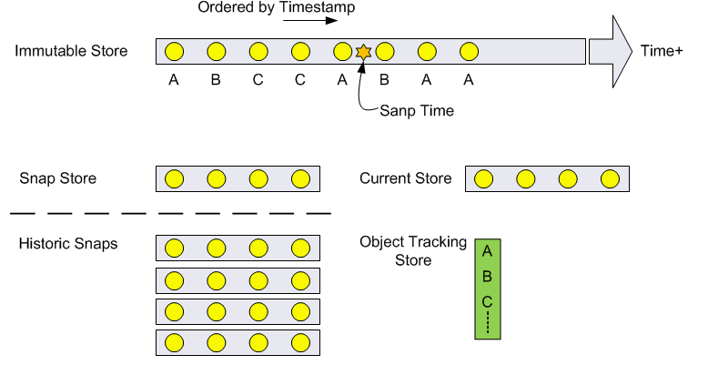

# storage-engine

A Clojure library designed to provide a mutable and immutable local Key, Value disk based stores/ caches with the ability to put and get as well as create and retrieve snapshots of part of or the entire state.
To be used for when your data set is too big to fit in memory, but you still want access to it very fast. Sequential reads are used whenever possible to increase read speed.
The cache is backed by the Google leveldb; primary storage
is disk (memory mapped files) with a configurable memory cache on top.

## Design
### Mutable Store
Key, Value pairs can be put and got from a 'current' store. That store can be snapped at any point to a named snapshot. The current store and a sanpshot store can be read back using a clojure lazy-seq or a java iterator.

### Immutable Store
The immutable store aims to solve a different problem space that the mutable:
- keep more data and be able to retrieve the historic state at a point in time which is not known in advance.
- have the option of using a remote/ centralised timestamp indexing keys. If the store is used in multiple remote locations from a central sender, the sender's time can be used to ensure that historic states retrieved in different locations are consistent.
Data is arranged on (spinning) disk, such that all bulk retrieve operations can be read off sequentially in the direction of the head moving over the disk platter and therefore ~100x faster than otherwise.

## Usage

TODO

## License

Copyright © 2014 Jude Payne

Distributed under the Eclipse Public License version 1.0
